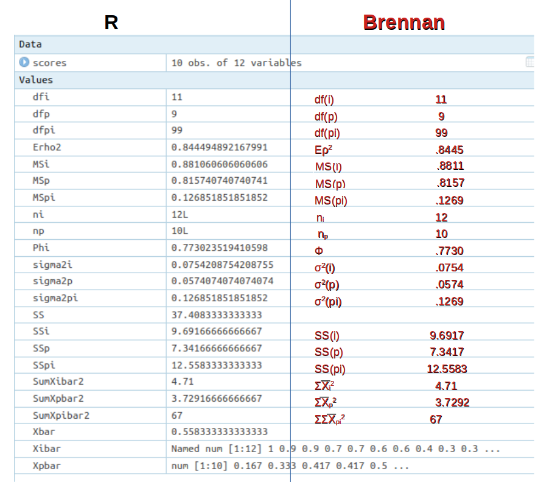
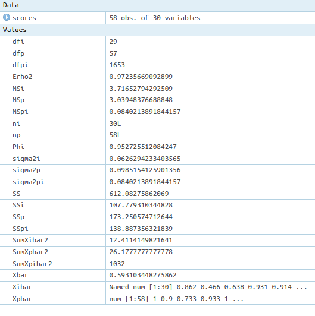
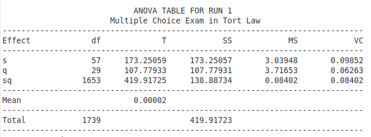
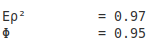

```{r setup, include=FALSE}
knitr::opts_chunk$set(echo = TRUE)
```

## Introduction {#sec-introduction}

Celebrating yet another birthday surrounded by my family, I was reminiscing about another birthday 70 years ago that directed me towards a life in the exact sciences. It was the hoped-for birthday present: a 12" scientific slide rule. It allowed me to do complex calculations efficiently and transparently.

At present I am similarly awed by the slide rule's 21. century successor - **R**, a tool, no modern scientist should be without. In my dotage, I spend much time popularizing Generalizability Theory, particularly a corresponding software tool [G-String](https://github.com/G-String-Legacy/GS_MV).

Generalizability Analysis (GA) is a statistical method for analyzing the validity of psychometric assessment tools, such as structured performance examinations. GA is an extension of "Analysis of Variance" (ANOVA), and applying GA to any meaningful examination or test examining a non-trivial group of subjects, could involve hundreds, if not thousands of arithmetic operations and thus would be highly error-prone for manual processing. Almost universally, assessment practitioners today use specialized software tools for GA, such as G-String. These programs are highly efficient but completely non-transparent!

In this R Notebook I would like to demonstrate how to perform the ANOVA calculations required for GA transparently and efficiently using **R**. Here is a simple (p x i) design from "Generalizability Theory" by R. L. Brennan: Tables 2.2 and 2.3 on page 28.

\pagebreak

Maybe, I should quickly explain the nomenclature used in the **R** calculations, since 'Rmd', the code used for the calculations, uses a slightly different set of characters. But it is actually quite simple to understand the symbolic equivalences from these examples:

> dfi -\> $df_{i}$

> Xpbar -\> $\overline{X}^2$

> SumXibar -\> $\sum_{i}\overline{X}^{2}_i$

> Erho2 -\> $E\rho^{2}$, etc.

## Set Table 2.2 {#sec-set-table-2.2}

```{r}
scores <- read.csv("scores.csv", header=FALSE)
# scores <- read.csv("ScoresMCQgh.csv", header=FALSE)
```

## Calculate row, col, and gross mean

```{r}
Xibar <- colMeans(scores)
Xpbar <- rowMeans(scores)
Xbar <- mean(Xpbar)
```

## Calculate sample sizes (n) and degrees of freedom (df)

```{r}
np <- nrow(scores)
ni <- ncol(scores)
dfp <- np -1
dfi <- ni -1
dfpi <- dfp * dfi
```

## Calculate Sum Squares

```{r}
SumXpbar2 <- sum(Xpbar^2)
SumXibar2 <- sum(Xibar^2)
SumXpibar2 <- sum(scores^2)
```

## ANOVA

```{r}
SS <- np * ni * Xbar ^ 2
SSp <- ni * SumXpbar2 - SS
SSi <- np * SumXibar2 - SS
SSpi <- SumXpibar2 - ni * SumXpbar2 - np * SumXibar2 + SS
MSp <- SSp / dfp
MSi <- SSi / dfi
MSpi <- SSpi / dfpi
sigma2p <- (MSp - MSpi)/ ni
sigma2i <- (MSi - MSpi)/ np
sigma2pi <- MSpi
```

## Generalizability Coefficients

```{r}
Erho2 <- sigma2p/(sigma2p + sigma2pi/ni)
Phi <- sigma2p/(sigma2p + (sigma2pi + sigma2i)/ni)
```

\pagebreak

## Results for Brennan's Table 2.2 data

 <br>

In other words, the few R instructions give us the correct answers.

------------------------------------------------------------------------

\newpage

## Results for Professor Hansen's Tort MCQ

But there is more to it. We simply replace Brennan's scores with those from the G-String website MCQ scores by commenting out 'scores \<- read.csv("scores.csv", header=FALSE)', and removing the hash mark from 'scores \<- read.csv("scoresMCQgh.csv", header=FALSE)'. It takes less than a second for the new results:



<br>

When we compare this with the results from G-String:

|    

<br> we see that sum scores and variance components are spot on! but let's now look at the Generalizability Coefficients:

|    

<br> They too match the results from R. However, remember that this Multiple Choice Exam represents the simple (p x i) design, where the ANOVA was straight forward. When analyzing more complex designs, the calculations become much more complicated. G-String employs Brennan's urGENOVA subroutine that uses elaborate iterative approaches, we can not easily replicate in simple R algorithms.
